# Vivid Logic System (Gestione Progetti Bis)

Benvenuto in **Vivid Logic System**, un'applicazione completa per la gestione dei progetti e dei task. Questa piattaforma è progettata per semplificare il coordinamento del team, la pianificazione e il monitoraggio delle attività attraverso un'interfaccia intuitiva e moderna.

## 🌟 Funzionalità Principali (Features)

L'applicazione offre una serie di schermate e funzionalità per coprire tutte le esigenze della gestione progettuale:

1.  **Dashboard Principale**: Una visione d'insieme del tuo lavoro. Riepilogo dei task, dei progetti, statistiche rapide e attività recenti.
    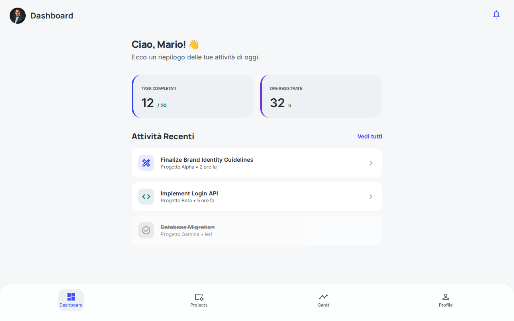
2.  **Lista Progetti**: Gestisci tutti i tuoi progetti in un unico posto. Visualizza lo stato di avanzamento, i membri del team coinvolti e accedi rapidamente ai dettagli di ciascun progetto.
    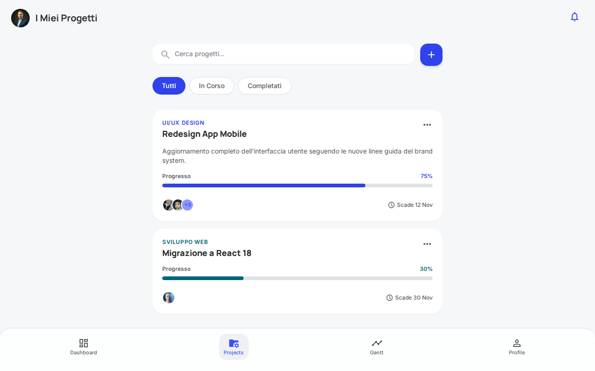
3.  **Dettaglio Task (Kanban/Lista)**: Organizza e monitora i singoli task. Visualizza descrizioni, assegnatari, scadenze, priorità e stato di avanzamento.
    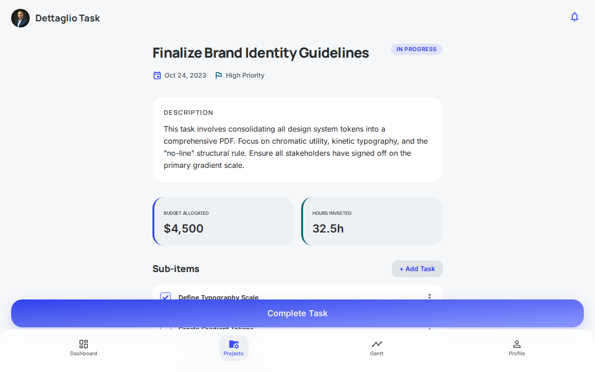
4.  **Configurazione Task**: Interfaccia dedicata per la creazione e la modifica dettagliata di un task, con opzioni per budget, ore spese, date di inizio e fine, e assegnazione al team.
    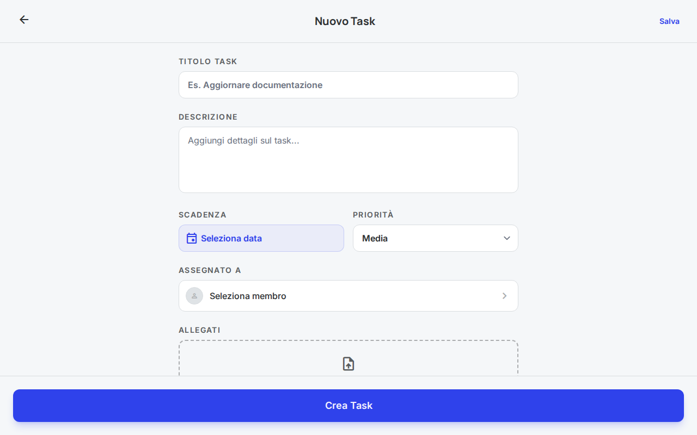
5.  **Diagramma di Gantt**: Una visualizzazione temporale dei progetti e dei task per comprendere facilmente le dipendenze, le scadenze e pianificare il lavoro nel tempo.
    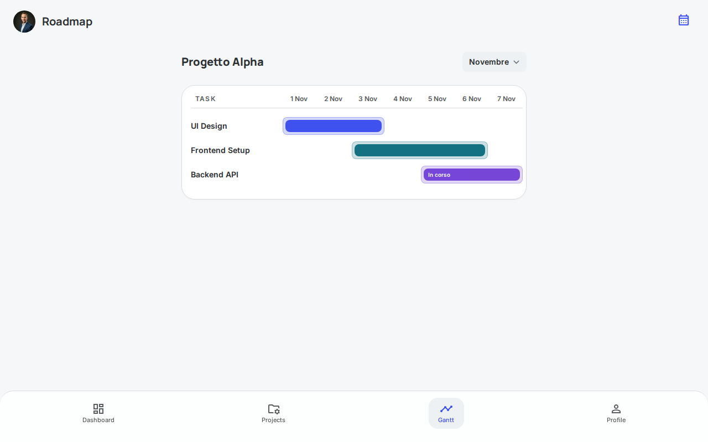
6.  **Calendario**: Visualizzazione a calendario per tenere traccia di tutte le scadenze, riunioni e milestone importanti del mese.
    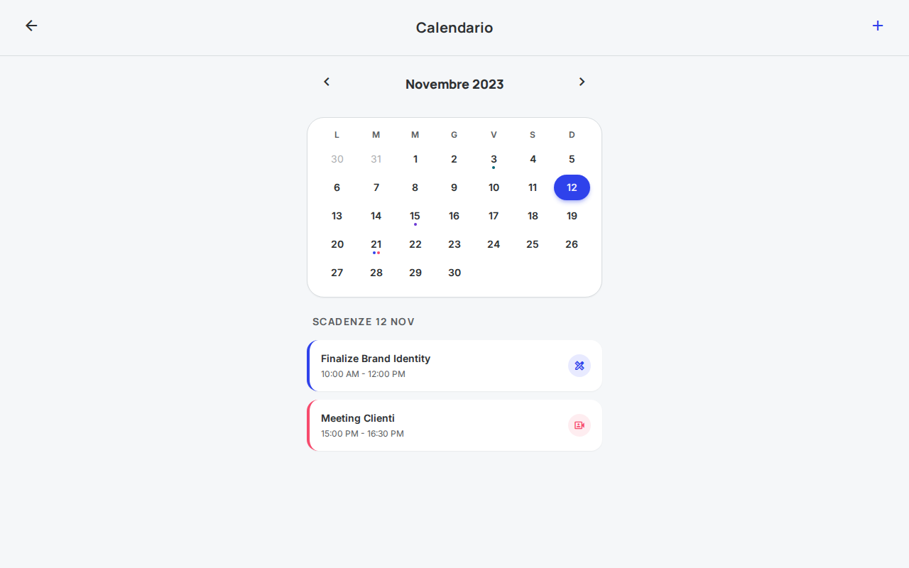
7.  **Gestione Allegati**: Area dedicata per caricare, visualizzare e organizzare i file e i documenti associati ai task e ai progetti.
    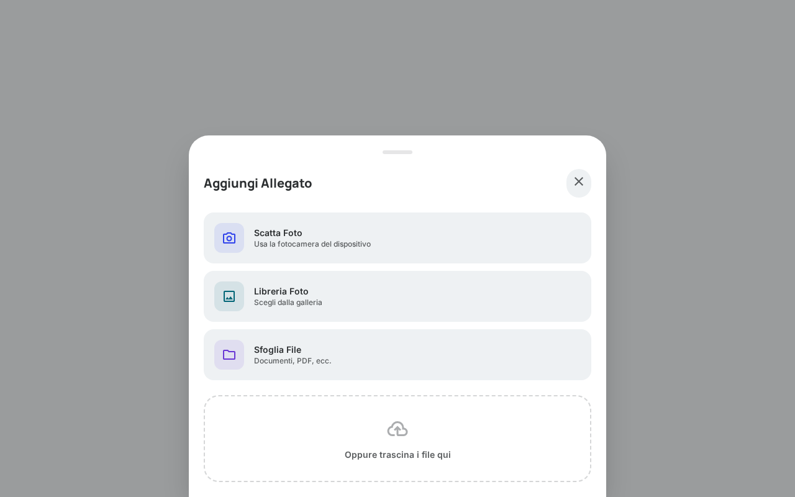
8.  **Notifiche**: Sistema di alert per rimanere sempre aggiornati su menzioni, scadenze imminenti e aggiornamenti di stato.
    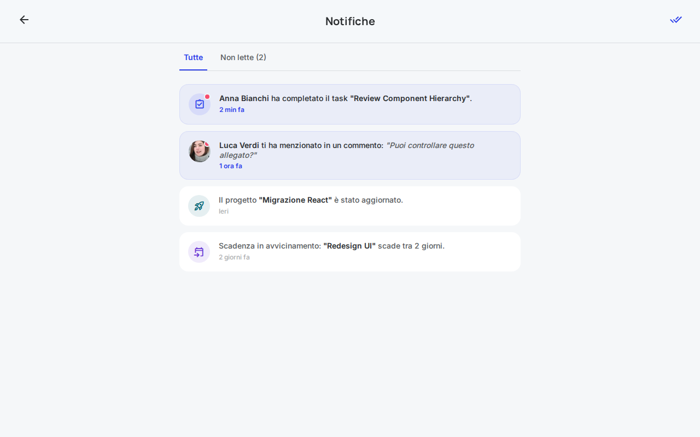
9.  **Profilo Utente**: Gestisci le tue informazioni personali, la foto profilo, le preferenze e le impostazioni dell'account.
    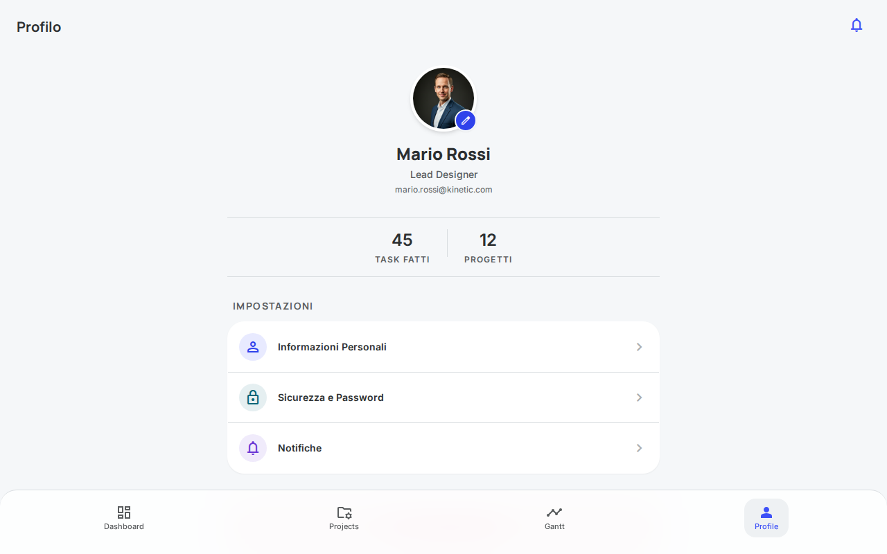
10. **Autenticazione Sicura**: Schermate dedicate per il Login e la Registrazione, con gestione sicura delle password tramite hashing e sessioni tramite JWT.
    *   **Login**: 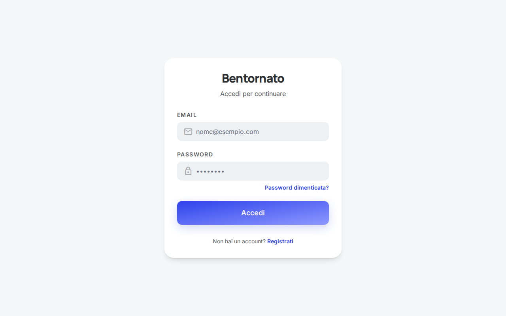
    *   **Registrazione**: 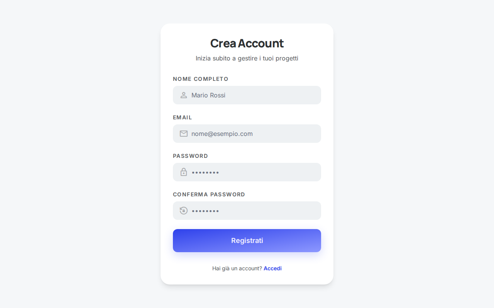

## 🛠️ Stack Tecnologico

*   **Backend**: Node.js, Express.js
*   **Database**: SQLite (Sviluppo/Test) / PostgreSQL (Produzione) tramite **Prisma ORM**
*   **Frontend**: HTML5, Tailwind CSS (via CDN), Google Fonts, Material Symbols
*   **Autenticazione**: JSON Web Tokens (JWT), bcryptjs per l'hashing delle password
*   **Email**: Nodemailer (con client SMTP locale non autenticato per i test)

## 🚀 Come Installare ed Eseguire l'App

Segui questi passaggi per configurare l'ambiente locale ed eseguire l'applicazione:

### 1. Prerequisiti

Assicurati di avere installati sul tuo sistema:
*   [Node.js](https://nodejs.org/) (versione 18 o superiore consigliata)
*   npm (Node Package Manager, incluso con Node.js)
*   Git

### 2. Clonare il Repository

Apri il terminale e clona il progetto (se non l'hai già fatto):

```bash
git clone https://github.com/teoconnect/gestioneprogetti-bis.git
cd gestioneprogetti-bis
```

### 3. Installare le Dipendenze

Installa tutte le librerie necessarie (Express, Prisma, bcryptjs, JWT, ecc.) eseguendo:

```bash
npm install
```

### 4. Configurare il Database (SQLite per lo sviluppo)

Il progetto è configurato per usare SQLite per l'ambiente di sviluppo locale. Per inizializzare il database e creare le tabelle definite nello schema, esegui i comandi di Prisma:

```bash
# Genera il Prisma Client
npx prisma generate

# Sincronizza lo schema con il database (crea dev.db e le tabelle)
npx prisma db push
```

*(Opzionale)* Se vuoi popolare il database con dati di test, puoi utilizzare l'interfaccia utente o creare uno script di seed personalizzato.

### 5. Avviare il Server

Ora sei pronto per avviare l'applicazione! Esegui:

```bash
npm start
```
*Il comando avvierà il server Node.js eseguendo `node index.js`.*

Dovresti vedere un messaggio nel terminale simile a: `Server running on port 3000`.

### 6. Accedere all'Applicazione

Apri il tuo browser preferito e vai all'indirizzo:

[http://localhost:3000/](http://localhost:3000/)

L'applicazione caricherà la prima schermata pubblica. Per accedere alle funzionalità protette, dovrai prima navigare alla pagina di registrazione (`/screen7_registration.html`) o login (`/screen9_login.html`) tramite i link (se configurati nell'interfaccia) o inserendo l'URL direttamente.

## 🧪 Testing

Il progetto include una suite di test (con Jest e Supertest) per verificare il corretto funzionamento delle API del backend.

Per eseguire i test, usa il comando:

```bash
npm test
```

Questo comando utilizzerà il database SQLite e verificherà gli endpoint di registrazione, login, creazione progetti e task.

---
Sviluppato per fornire una gestione logica e vivida dei tuoi progetti!
